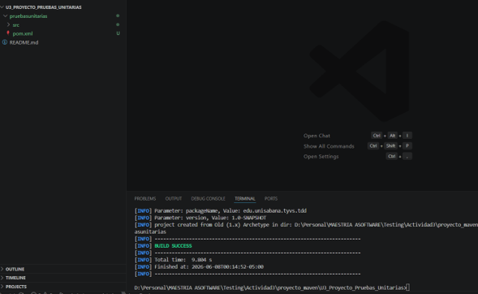
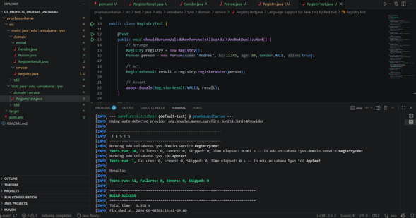

# Proyecto de Pruebas Unitarias - Registraduría

## 1. Descripción del proyecto

Este proyecto corresponde al taller de automatización de pruebas unitarias de la Unidad 3.
El objetivo es implementar pruebas unitarias sobre un caso de uso de una registraduría, aplicando buenas prácticas de desarrollo dirigido por pruebas **TDD**, patrón **AAA** y diseño de pruebas mediante **clases de equivalencia** y **valores límite**.

El sistema permite validar el registro de una persona como votante a partir de reglas de negocio relacionadas con:

* Edad de la persona.
* Estado de vida.
* Identificador único.
* Duplicidad del registro.
* Validaciones defensivas frente a datos nulos o inválidos.

---

## 2. Tecnologías utilizadas

* Java
* Maven
* JUnit
* Visual Studio Code
* Git / GitHub

---

## 3. Estructura del proyecto

El proyecto fue creado con Maven usando el arquetipo `maven-archetype-quickstart`.

```text
pruebasunitarias/
│
├── pom.xml
│
├── src/
│   ├── main/
│   │   └── java/
│   │       └── edu/
│   │           └── unisabana/
│   │               └── tyvs/
│   │                   └── domain/
│   │                       ├── model/
│   │                       │   ├── Gender.java
│   │                       │   ├── Person.java
│   │                       │   └── RegisterResult.java
│   │                       │
│   │                       └── service/
│   │                           └── Registry.java
│   │
│   └── test/
│       └── java/
│           └── edu/
│               └── unisabana/
│                   └── tyvs/
│                       └── domain/
│                           └── service/
│                               └── RegistryTest.java
```

---

## 4. Modelo de dominio

### 4.1. Clase `Person`

La clase `Person` representa una persona que puede ser registrada como votante.

Atributos principales:

| Atributo | Tipo      | Descripción                       |
| -------- | --------- | --------------------------------- |
| `name`   | `String`  | Nombre de la persona              |
| `id`     | `int`     | Identificador único de la persona |
| `age`    | `int`     | Edad de la persona                |
| `gender` | `Gender`  | Género de la persona              |
| `alive`  | `boolean` | Indica si la persona está viva    |

---

### 4.2. Enumeración `Gender`

La enumeración `Gender` define los posibles valores de género utilizados en el dominio:

```java
public enum Gender {
    MALE,
    FEMALE,
    UNIDENTIFIED
}
```

---

### 4.3. Enumeración `RegisterResult`

La enumeración `RegisterResult` define los posibles resultados del proceso de registro:

```java
public enum RegisterResult {
    VALID,
    DUPLICATED,
    INVALID,
    DEAD,
    UNDERAGE,
    INVALID_AGE
}
```

| Resultado     | Descripción                                      |
| ------------- | ------------------------------------------------ |
| `VALID`       | La persona puede ser registrada correctamente    |
| `DUPLICATED`  | La persona ya fue registrada previamente         |
| `INVALID`     | La persona o sus datos principales son inválidos |
| `DEAD`        | La persona no está viva                          |
| `UNDERAGE`    | La persona es menor de edad                      |
| `INVALID_AGE` | La edad está fuera del rango permitido           |

---

## 5. Servicio principal

### Clase `Registry`

La clase `Registry` contiene el caso de uso principal del sistema:

```java
public RegisterResult registerVoter(Person p)
```

Este método recibe una persona y retorna un resultado de tipo `RegisterResult`.

Reglas implementadas:

1. Si la persona es `null`, retorna `INVALID`.
2. Si el identificador es menor o igual a cero, retorna `INVALID`.
3. Si la persona no está viva, retorna `DEAD`.
4. Si la edad es menor que cero o mayor que 120, retorna `INVALID_AGE`.
5. Si la edad es menor que 18, retorna `UNDERAGE`.
6. Si el identificador ya fue registrado, retorna `DUPLICATED`.
7. Si todas las validaciones pasan, retorna `VALID`.

---

## 6. Aplicación de TDD

Durante el desarrollo se aplicó el ciclo **Red → Green → Refactor**.

### 6.1. Red

Se escribieron pruebas unitarias antes de implementar completamente la lógica del método `registerVoter`.

Ejemplo:

* Se creó una prueba para validar que una persona muerta no pudiera registrarse.
* Inicialmente la prueba falló porque el método retornaba siempre `VALID`.

### 6.2. Green

Se implementó la lógica mínima para que la prueba pasara.

Ejemplo:

```java
if (!p.isAlive()) {
    return RegisterResult.DEAD;
}
```

### 6.3. Refactor

Se mejoró el código sin romper las pruebas existentes.

Ejemplos de refactorización:

* Se agregó validación defensiva para `null`.
* Se separaron los resultados `INVALID`, `DEAD`, `UNDERAGE` e `INVALID_AGE`.
* Se organizaron las condiciones de validación.
* Se agregaron constantes para la edad mínima y máxima válida.

---

## 7. Patrón AAA

Las pruebas unitarias fueron escritas usando el patrón **AAA**:

| Fase    | Descripción                              |
| ------- | ---------------------------------------- |
| Arrange | Preparar objetos, datos y estado inicial |
| Act     | Ejecutar el método que se quiere probar  |
| Assert  | Verificar el resultado esperado          |

Ejemplo:

```java
@Test
public void shouldReturnValidWhenPersonIsAliveAdultAndNotDuplicated() {
    // Arrange
    Registry registry = new Registry();
    Person person = new Person("Andres", 12345, 30, Gender.MALE, true);

    // Act
    RegisterResult result = registry.registerVoter(person);

    // Assert
    assertEquals(RegisterResult.VALID, result);
}
```

---

## 8. Clases de equivalencia y valores límite

Para diseñar las pruebas se definieron clases de equivalencia sobre los atributos principales del dominio.

### 8.1. Edad

| Clase                  | Condición           | Resultado esperado | Valor de prueba |
| ---------------------- | ------------------- | ------------------ | --------------- |
| Edad inválida inferior | `edad < 0`          | `INVALID_AGE`      | `-1`            |
| Menor de edad          | `0 <= edad < 18`    | `UNDERAGE`         | `17`            |
| Edad válida inferior   | `edad = 18`         | `VALID`            | `18`            |
| Edad válida            | `18 <= edad <= 120` | `VALID`            | `30`            |
| Edad válida superior   | `edad = 120`        | `VALID`            | `120`           |
| Edad inválida superior | `edad > 120`        | `INVALID_AGE`      | `121`           |

### 8.2. Estado de vida

| Clase          | Condición       | Resultado esperado  |
| -------------- | --------------- | ------------------- |
| Persona viva   | `alive = true`  | Continúa evaluación |
| Persona muerta | `alive = false` | `DEAD`              |

### 8.3. Identificador

| Clase        | Condición                 | Resultado esperado  |
| ------------ | ------------------------- | ------------------- |
| ID inválido  | `id <= 0`                 | `INVALID`           |
| ID único     | ID no registrado          | Continúa evaluación |
| ID duplicado | ID registrado previamente | `DUPLICATED`        |

### 8.4. Nulidad

| Clase        | Condición        | Resultado esperado |
| ------------ | ---------------- | ------------------ |
| Persona nula | `person == null` | `INVALID`          |

---

## 9. Matriz de pruebas

| Caso                | Entrada                        | Resultado esperado | Método de prueba                                          |
| ------------------- | ------------------------------ | ------------------ | --------------------------------------------------------- |
| Persona válida      | edad=30, alive=true, id=12345  | `VALID`            | `shouldReturnValidWhenPersonIsAliveAdultAndNotDuplicated` |
| Persona muerta      | edad=40, alive=false, id=54321 | `DEAD`             | `shouldReturnDeadWhenPersonIsNotAlive`                    |
| Menor de edad       | edad=17, alive=true            | `UNDERAGE`         | `shouldReturnUnderageWhenPersonIs17YearsOld`              |
| Mayoría de edad     | edad=18, alive=true            | `VALID`            | `shouldReturnValidWhenPersonIs18YearsOld`                 |
| Edad máxima válida  | edad=120, alive=true           | `VALID`            | `shouldReturnValidWhenPersonIs120YearsOld`                |
| Edad negativa       | edad=-1, alive=true            | `INVALID_AGE`      | `shouldReturnInvalidAgeWhenPersonHasNegativeAge`          |
| Edad superior a 120 | edad=121, alive=true           | `INVALID_AGE`      | `shouldReturnInvalidAgeWhenPersonIsOlderThan120`          |
| Persona duplicada   | id=777 dos veces               | `DUPLICATED`       | `shouldReturnDuplicatedWhenPersonIdWasAlreadyRegistered`  |
| Persona nula        | person=null                    | `INVALID`          | `shouldReturnInvalidWhenPersonIsNull`                     |
| ID inválido         | id=0                           | `INVALID`          | `shouldReturnInvalidWhenPersonIdIsZero`                   |

---

## 10. Ejecución del proyecto

Para compilar el proyecto:

```bash
mvn clean compile
```

Para ejecutar las pruebas unitarias:

```bash
mvn clean test
```

Resultado esperado:

```text
BUILD SUCCESS
```

---

## 11. Evidencias de ejecución

Las evidencias del taller incluyen:

* Captura de la estructura del proyecto.
* Captura de las clases de dominio.
* Captura de las pruebas unitarias.
* Captura de la ejecución con `mvn clean test`.
* Captura del resultado `BUILD SUCCESS`.


## Evidencias de ejecución

### Creación del proyecto Maven



### Actualización del archivo pom.xml con JUnit


### Estructura del proyecto


### Ciclo TDD - Red

En esta evidencia se observa una prueba fallida como parte del ciclo Red de TDD.


### Ciclo TDD - Green

En esta evidencia se observa la ejecución exitosa de las pruebas luego de implementar la lógica mínima.


### Ejecución final de pruebas



---

## 12. Resultados obtenidos

Durante la ejecución de las pruebas se validaron los principales escenarios del método `registerVoter`.

Resultado esperado:

```text
Tests run: 11, Failures: 0, Errors: 0, Skipped: 0
BUILD SUCCESS
```

Nota: el número total de pruebas puede variar si se conserva la prueba generada automáticamente por Maven en `AppTest.java`.

---

## 13. Conclusiones

La implementación de pruebas unitarias permitió validar las reglas principales del proceso de registro de votantes. El uso de TDD facilitó construir la lógica de forma incremental, comenzando por pruebas que fallaban, luego implementando la solución mínima y finalmente refactorizando el código.

El patrón AAA ayudó a mantener pruebas claras, ordenadas y fáciles de entender. Además, el uso de clases de equivalencia y valores límite permitió cubrir escenarios representativos del dominio, tales como edad mínima, edad máxima, persona muerta, persona nula, identificador inválido y registro duplicado.

Este enfoque mejora la calidad del software, reduce riesgos de regresión y permite que futuros cambios en la lógica del sistema puedan validarse automáticamente mediante la ejecución de las pruebas.

---

## 14. Autor

Proyecto desarrollado para el taller de automatización de pruebas unitarias.

Estudiante: Camilo Andrés Porras
Curso: Herramientas de automatización de pruebas
Unidad: Automatización de pruebas unitarias y métricas de cobertura
